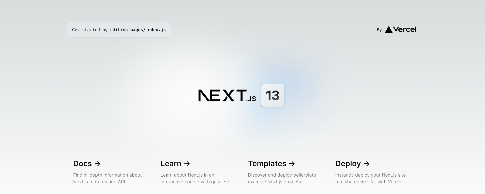

 ## Quest

**1. What is the difference between frontend and backend? Can you provide a real life example? Note: You can't use the one in this chapter.** 
 The frontend deals with the User interface and it's functionality, while on the backend you can work with a database, create routes etc.

**2. What is the difference between global styling and module styling?** 
 Global styling applies to everything whilst modules only applies to the files in which they were imported.

https://github.com/Xernaxe/beginner-emerald-dapp