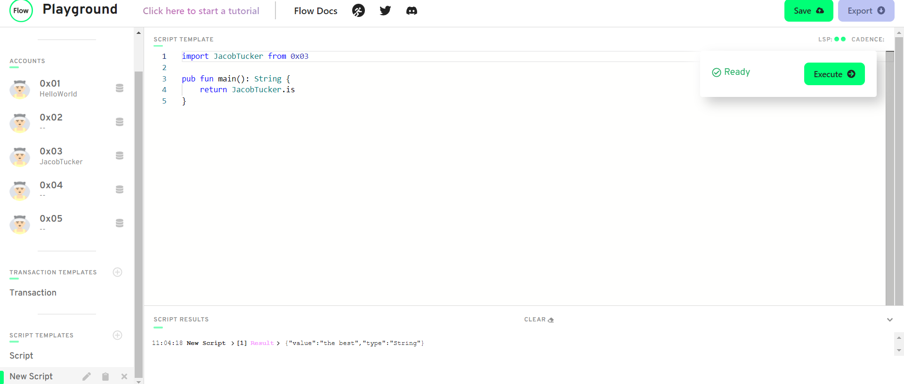

 ## Quest
<hr>

Contract
```
pub contract JacobTucker {

    pub let is: String

    init() {
      self.is = "the best"
    }
}
```

Script
```
import JacobTucker from 0x03

pub fun main(): String {
    return JacobTucker.is
}
```




