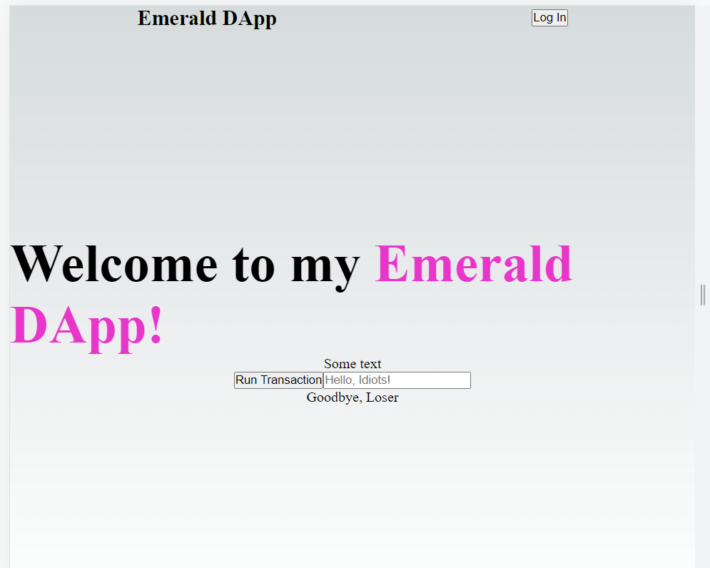
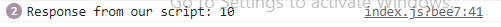

## Quest

<hr>

Quest 1:


Quest 2.a:

```
	async function executeScript2() {
		const response = await fcl.query({
			cadence: `
      import SimpleTest from 0x6c0d53c676256e8c

      pub fun main(): Int {
          return SimpleTest.number
      }
      `,
			args: (arg, t) => [], // ARGUMENTS GO IN HERE
		});
		console.log('Response from our script: ' + response);
	}
```

```
<button onClick={executeScript2}>Execute Script</button>
```



Quest 2.b:

```
	async function executeScript2() {
		const response = await fcl.query({
			cadence: `
      import SimpleTest from 0x6c0d53c676256e8c

      pub fun main(): Int {
          return SimpleTest.number
      }
      `,
			args: (arg, t) => [], // ARGUMENTS GO IN HERE
		});
		console.log('Response from our script: ' + response);
	}

    useEffect(() => {
    executeScript2()
  }, [])
```
