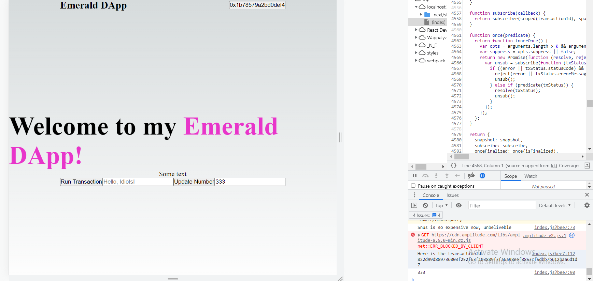

## Quest

<hr>

```
async function runScript() {
    const response = await fcl.query({
      cadence: `
      import SimpleTest from 0x6c0d53c676256e8c
      pub fun main(): Int {
        return SimpleTest.number
      }
      `,
      args: (arg, t) => []
    })
    console.log(response)
  }

	const [newNumber, setNewNumber] = useState('');
  
	async function runTransaction() {
		const transactionId = await fcl.mutate({
			cadence: `
      import SimpleTest from 0x6c0d53c676256e8c 
      transaction(myNewNumber: Int) {
        prepare(signer: AuthAccount) {}
        execute {
          SimpleTest.updateNumber(newNumber: myNewNumber)
        }
      }
      `,
			args: (arg, t) => [arg(newNumber, t.Int)],
			proposer: fcl.authz,
			payer: fcl.authz,
			authorizations: [fcl.authz],
			limit: 999,
		});

		console.log('Here is the transactionId: ' + transactionId);
    await fcl.tx(transactionId).onceSealed()
    runScript()
	}
```

