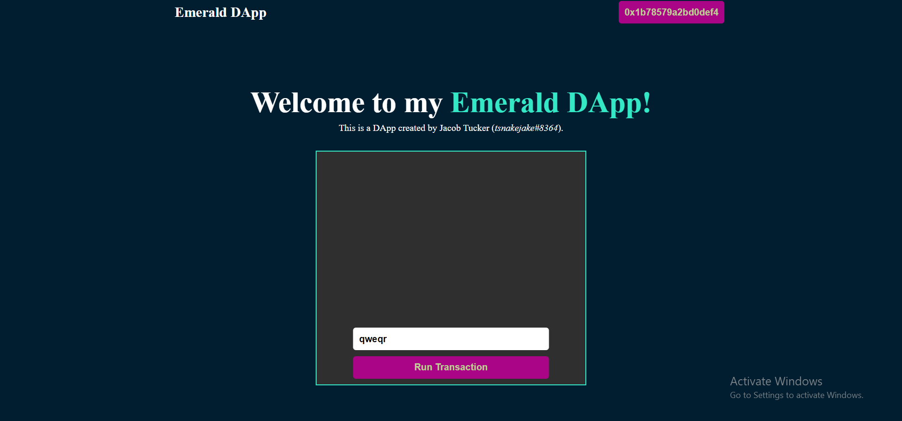

 ## Quest
<hr>

**1. List all the possible transaction status codes and what each of them mean.**<br/>
0	Unknown <br/>
1	Transaction Pending - Awaiting Finalization <br/>
2	Transaction Finalized - Awaiting Execution <br/>
3	Transaction Executed - Awaiting Sealing <br/>
4	Transaction Sealed - Transaction Complete. At this point the transaction result has been committed to the blockchain. <br/>
5	Transaction Expired

**2. What does setTimeout do?**<br/>
 Runs the code after x amount of time (in ms)

**3. How would we change our code if we wanted the txStatus variable to reset back to its original state after 5 seconds?**<br/>
 ```setTimeout(() => setTxStatus('Run Transaction'), 5000)```

**4. What does the fcl.tx(transactionId).subscribe(res => {...}) function do?**<br/>
 The function changes the variable txStatus according to the response status.

**3. Make at least 3 changes to the styling of the application. It can be anything (part of this quest is being creative!). List the 3 changes and point them out in a screenshot.**<br/>
 The prepare phase first prepare all the required data from the user account. <br/>
 The execute phase then uses the data (via functions) that was previously prepared.


